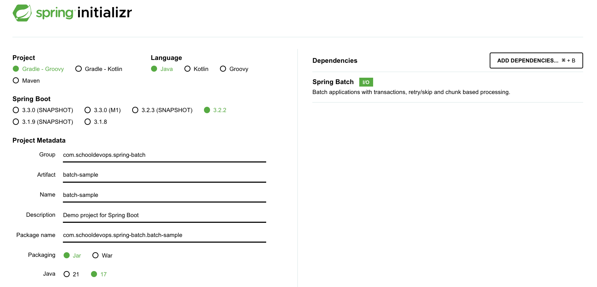
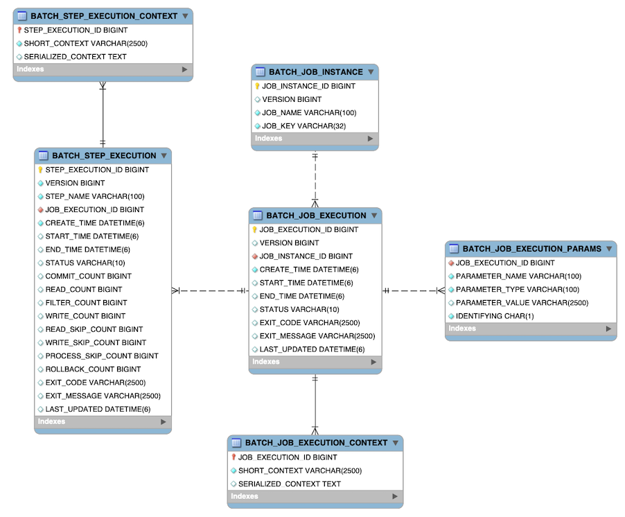

# Spring Batch 초기화 및 스프링배치 필요정보 
 
## 기본 프로젝트 구성하기

- https://start.spring.io 에서 다음과 같이 스프링 배치를 위한 기본 프로젝트를 설정하자. 



- 위와 같이 프로젝트를 구성하자. 

## 배치를 위한 기본 설정

### build.gradle 

```groovy
plugins {
	id 'java'
	id 'org.springframework.boot' version '3.2.2'
	id 'io.spring.dependency-management' version '1.1.4'
}

group = 'com.schooldevops.spring-batch'
version = '0.0.1-SNAPSHOT'

java {
	sourceCompatibility = '17'
}

configurations {
	compileOnly {
		extendsFrom annotationProcessor
	}
}

repositories {
	mavenCentral()
}

dependencies {
	implementation 'org.springframework.boot:spring-boot-starter-batch'
	testImplementation 'org.springframework.boot:spring-boot-starter-test'
	testImplementation 'org.springframework.batch:spring-batch-test'
	compileOnly 'org.projectlombok:lombok'
	annotationProcessor 'org.projectlombok:lombok'
}

tasks.named('test') {
	useJUnitPlatform()
}

```

- 위와 깉이 spring-boot-starter-batch 라는 의존성 파일이 추가되어 있음을 확인할 수 있다. 

### 배치 기동시키기 

- `@EnableBatchProcessing` 어노테이션을 이용하면 기본적으로 스프링 배치 모드로 동작하게 된다. 

```java
package com.schooldevops.springbatch.batchsample;

import org.springframework.batch.core.configuration.annotation.EnableBatchProcessing;
import org.springframework.boot.SpringApplication;
import org.springframework.boot.autoconfigure.SpringBootApplication;

@EnableBatchProcessing
@SpringBootApplication
public class BatchSampleApplication {

	public static void main(String[] args) {
		SpringApplication.run(BatchSampleApplication.class, args);
	}

}

```

- 위와 같이 기본적으로 @EnableBatchProcessing 어노테이션을 추가하면 배치를 처리할 준비는 끝이났다. 

## 실행해보기 

- `gradle :bootRun` 명령을 통해 실행해보자. 
- 다음과 같은 오류가 나타난다. 

```sh
08:49:03: Executing 'bootRun'...

> Task :compileJava UP-TO-DATE
> Task :processResources UP-TO-DATE
> Task :classes UP-TO-DATE
> Task :resolveMainClassName

> Task :bootRun FAILED

  .   ____          _            __ _ _
 /\\ / ___'_ __ _ _(_)_ __  __ _ \ \ \ \
( ( )\___ | '_ | '_| | '_ \/ _` | \ \ \ \
 \\/  ___)| |_)| | | | | || (_| |  ) ) ) )
  '  |____| .__|_| |_|_| |_\__, | / / / /
 =========|_|==============|___/=/_/_/_/
 :: Spring Boot ::                (v3.2.2)

2024-01-31T08:49:04.675+09:00  INFO 65757 --- [           main] c.s.s.b.BatchSampleApplication           : Starting BatchSampleApplication using Java 17.0.8 with PID 65757 (/Users/1111489/Documents/06.PROGRAMMING_COURSES/Spring-Batch/batch-sample-01/build/classes/java/main started by 1111489 in /Users/1111489/Documents/06.PROGRAMMING_COURSES/Spring-Batch/batch-sample-01)
2024-01-31T08:49:04.676+09:00  INFO 65757 --- [           main] c.s.s.b.BatchSampleApplication           : No active profile set, falling back to 1 default profile: "default"
2024-01-31T08:49:04.814+09:00  INFO 65757 --- [           main] o.s.b.c.c.annotation.BatchRegistrar      : Finished Spring Batch infrastructure beans configuration in 2 ms.
2024-01-31T08:49:04.911+09:00  WARN 65757 --- [           main] trationDelegate$BeanPostProcessorChecker : Bean 'jobRegistry' of type [org.springframework.batch.core.configuration.support.MapJobRegistry] is not eligible for getting processed by all BeanPostProcessors (for example: not eligible for auto-proxying). Is this bean getting eagerly injected into a currently created BeanPostProcessor [jobRegistryBeanPostProcessor]? Check the corresponding BeanPostProcessor declaration and its dependencies.
2024-01-31T08:49:04.930+09:00  WARN 65757 --- [           main] s.c.a.AnnotationConfigApplicationContext : Exception encountered during context initialization - cancelling refresh attempt: org.springframework.beans.factory.UnsatisfiedDependencyException: Error creating bean with name 'dataSourceScriptDatabaseInitializer' defined in class path resource [org/springframework/boot/autoconfigure/sql/init/DataSourceInitializationConfiguration.class]: Unsatisfied dependency expressed through method 'dataSourceScriptDatabaseInitializer' parameter 0: Error creating bean with name 'dataSource' defined in class path resource [org/springframework/boot/autoconfigure/jdbc/DataSourceConfiguration$Hikari.class]: Failed to instantiate [com.zaxxer.hikari.HikariDataSource]: Factory method 'dataSource' threw exception with message: Failed to determine a suitable driver class
2024-01-31T08:49:04.935+09:00  INFO 65757 --- [           main] .s.b.a.l.ConditionEvaluationReportLogger : 

Error starting ApplicationContext. To display the condition evaluation report re-run your application with 'debug' enabled.
2024-01-31T08:49:04.943+09:00 ERROR 65757 --- [           main] o.s.b.d.LoggingFailureAnalysisReporter   : 

***************************
APPLICATION FAILED TO START
***************************

Description:

Failed to configure a DataSource: 'url' attribute is not specified and no embedded datasource could be configured.

Reason: Failed to determine a suitable driver class


Action:

Consider the following:
	If you want an embedded database (H2, HSQL or Derby), please put it on the classpath.
	If you have database settings to be loaded from a particular profile you may need to activate it (no profiles are currently active).

4 actionable tasks: 2 executed, 2 up-to-date
```

- 위 의미는 SpringBatch 를 실행하기 위해서 DataSource가 필요하며 DataSource를 위한 기본 설정이 없다고 우리에게 클레임을 걸고 있다.

### DataSource 구성하기 

- 별도 MySQL등을 설치하기보다 MemoryDB를 이용할 수 있도록 다음과 같이 설정하자. 
- 이들은 모두 경량의 메모리 기반/파일기반 데이터베이스이다. 
- 각각에 대해서 살펴보자. 

#### H2 Database

- 특징:
  - 메모리 데이터베이스
    - 주로 테스트 및 개발 전용으로 사용되며, 메모리에 데이터를 저장한다. 
  - 경량/빠른속도
    - 경량의 데이터베이스로 높은 성능을 보여준다.
  - 자체 웹 콘솔 제공
    - 웹 기반 콘솔을 제공하며 이를 통해 데이터베이스를 관리할 수 있다. 

- application.yaml 파일에 다음과 같이 작성하기
  
```yaml
# H2 DataBase용
spring:
  datasource:
    hikari:
      maximum-pool-size: 10
    url: jdbc:h2:mem:testdb
    driver-class-name: org.h2.Driver
    username: sa
    password: password
```

- 의존성 추가 build.gradle 에 다음과 같이 추가한다. 

```yml
implementation 'com.h2database:h2:2.2.224'
```

#### HSQL Database

- 특징
  - 경량 데이터베이스
    - 메모리 또는 파일 기반으로 데이터 저장
  - 자바기반
    - 100% 자바로 개발된 데이터베이스
    - Java 어플리케이션의 내장 데이터베이스로 사용가능
  - SQL-92 호환
    - 표준 SQL 문법 지원
- application.yaml 파일에 다음과 같이 작성하자. 

```yaml
# HSQL DataBase용
spring:
  datasource:
    hikari:
      maximum-pool-size: 10
    url: jdbc:hsqldb:mem:testdb
    driver-class-name: org.hsqldb.jdbc.JDBCDriver
    username: sa
    password: password
```

- build.gradle 파일에 다음 의존 파일을 추기한다. 

```yaml
implementation 'org.hsqldb:hsqldb:2.7.2'
```

#### Apache Derby Database

- 특징
  - 자바 기반 데이터베이스
    - Java 어플리케이션 내 내장 데이터베이스로 사용가능
  - 네트워크 및 임베디드 모드
    - 서버 모드와 내장(임베디드)를 지원한다. 
  - 트랜잭션 지원
    - ACID 제공
- application.yml 파일에 다음과 같이 작성하자. 

```yml
# Derby DataBase용
spring:
  datasource:
    hikari:
      maximum-pool-size: 10
    url: jdbc:derby:memory:testdb;create=true
    driver-class-name: org.apache.derby.jdbc.EmbeddedDriver
    username: sa
    password: password
```

- build.gradle 파일에 다음과 같의 의존성을 추가한다. 

```yaml
implementation 'org.apache.derby:derby:10.17.1.0'
```

- 위 데이터베이스는 메모리/파일 기반 데이터베이스로 여기서는 단순하게 H2 를 이용해보자. 

### 다시 실행해보기 

- 다시 실행하면 정상으로 수행됨을 알수 있다 

## 스프링배치 스키마 구조 

- 즉 스프링배치를 수행하면 자동으로 배치를 위한 스키마가 생성이 된다. 
- 다음은 스키마 구조이다. 



- 참조: https://docs.spring.io/spring-batch/reference/schema-appendix.html

### BATCH_JOB_INSTANCE Table

- 스키마중 가장 기본이 되는 배치 잡 인스턴스 테이블이다. 
- 배치가 수행되면 Job이 생성이 되고, 해당 잡 인스턴스에 대해서 관련된 모든 정보를 가진 최상위 테이블이다. 

```sql
CREATE TABLE BATCH_JOB_INSTANCE  (
  JOB_INSTANCE_ID BIGINT  PRIMARY KEY ,
  VERSION BIGINT,
  JOB_NAME VARCHAR(100) NOT NULL ,
  JOB_KEY VARCHAR(32) NOT NULL
);
```

- JOB_INSTANCE_ID: 인스턴스에 대한 유니크 아이디이다. JobInstance 객체의 getId로 획득이 가능하다. 
- VERSION: 버젼정보
- JOB_NAME: 배치잡 객체로 획득한 잡 이름이다. 인스턴스를 식별하기 위해 필요하다. 널이 될 수 없다. 
- JOB_KEY: JobParameter를 직렬화한 데이터값이며, 동일한 잡을 다른 잡과 구분하는 값이다. 잡은 이 JobParameter가 동일할 수 없으며, JOB_KEY는 구별될수 있도록 달라야한다. 

### BATCH_JOB_EXECUTION_PARAMS Table

- JobParameter에 대한 정보를 저장하는 테이블이다. 
- 여기에는 하나 이상의 key/value 쌍으로 Job에 전달되며, job이 실행될때 전달된 파라미터 정보를 저장하게 된다. 
- 각 파라미터는 IDENTIFYING이 true로 설정되면, JobParameter 생성시 유니크한 값으로 사용된경우라는 의미가 된다. 
- 테이블은 비정규화 되어 있고, 구조는 다음과 같다. 

```sql
CREATE TABLE BATCH_JOB_EXECUTION_PARAMS  (
	JOB_EXECUTION_ID BIGINT NOT NULL ,
	PARAMETER_NAME VARCHAR(100) NOT NULL ,
	PARAMETER_TYPE VARCHAR(100) NOT NULL ,
	PARAMETER_VALUE VARCHAR(2500) ,
	IDENTIFYING CHAR(1) NOT NULL ,
	constraint JOB_EXEC_PARAMS_FK foreign key (JOB_EXECUTION_ID)
	references BATCH_JOB_EXECUTION(JOB_EXECUTION_ID)
);
``` 

- JOB_EXECUTION_ID: 잡 실행 아이디이며 이것은 BATCH_JOB_EXECUTION으로 부터 온 외래키이다. 각 실행마다 여러 행(키/값) 이 저장된다. 
- PARAMETER_NAME: 파라미터 이름
- PARAMETER_TYPE: 파라미터의 타입
- PARAMETER_VALUE: 파라미터 값
- IDENTIFYING: 파라미터가 JobInstance의 유니크성을 위해 사용된 파라미터라면 true로 세팅된다. 
- 이 테이블에는 기본키가 없다. 

### BATCH_JOB_EXECUTION Table

- JobExecution과 관련된 모든 정보를 저장한다. 
- Job이 매번 실행될때, JobExecution이라는 새로운 객체가 있으며, 이 테이블에 새로운 row로 생성이 된다. 
- 다음은 테이블 구조이다. 

```sql
CREATE TABLE BATCH_JOB_EXECUTION  (
  JOB_EXECUTION_ID BIGINT  PRIMARY KEY ,
  VERSION BIGINT,
  JOB_INSTANCE_ID BIGINT NOT NULL,
  CREATE_TIME TIMESTAMP NOT NULL,
  START_TIME TIMESTAMP DEFAULT NULL,
  END_TIME TIMESTAMP DEFAULT NULL,
  STATUS VARCHAR(10),
  EXIT_CODE VARCHAR(20),
  EXIT_MESSAGE VARCHAR(2500),
  LAST_UPDATED TIMESTAMP,
  constraint JOB_INSTANCE_EXECUTION_FK foreign key (JOB_INSTANCE_ID)
  references BATCH_JOB_INSTANCE(JOB_INSTANCE_ID)
) ;
```

- JOB_EXECUTION_ID: 배치자 실행 아이디, 실행을 유니크하게 구분할 수 있다. 칼럼의 값은 JobExecution 의 getId메소드로 획득이 가능하다. 
- VERSION: 버젼정보
- JOB_INSTANCE_ID: BATCH_JOB_INSTANCE 테이블의 기본키로 외래키이다. 이는 execution이 소속된 인스턴스가 된다. 하나의 인스턴스에는 여러 execution이 있을 수 있다. 
- CREATE_TIME: execution이 생성된 시간이다. 
- START_TIME: execution이 시작된 시간이다. 
- END_TIME: execution이 종료된 시간이다. 성공이든 실패든 남게된다. 잡이 현재 실행중이 아닐때 열의 값이 비어 있다면, 특정 유형의 오류가 발생하여 프레임워크가 실패하기전 마지막 저장을 수행할 수 없음을 나타낸다. 
- STATUS: execution의 현재 상태를 문자열로 나타낸다. COMPLETED, STARTED 및 기타, 이는 BatchStatus 나열값으로 채워진다. 
- EXIT_CODE: execution의 종료 코드를 문자열로 나타낸다. 커맨드라인 잡의 케이스에서는 숫자로 변환된다. 
- EXIT_MESSAGE: job이 종류되는 경우 어떻게 종료되었는지를 나타낸다. 가능하다면 stack trace값이 남게 된다. 
- LAST_UPDATED: execution이 마지막으로 지속된 시간을 나타내는 타임스탬프이다. 

### BATCH_STEP_EXECUTION Table

- BATCH_STEP_EXECUTION Table 은 StepExecution과 관련된 모든 정보를 가진다. 
- 이 테이블은 여러 면에서 BATCH_JOB_EXECUTION 테이블과 유사하며 생성된 각 JobExecution에 대한 단계당 항목이 항상 하나 이상이 있다. 

```sql
CREATE TABLE BATCH_STEP_EXECUTION  (
  STEP_EXECUTION_ID BIGINT NOT NULL PRIMARY KEY ,
  VERSION BIGINT NOT NULL,
  STEP_NAME VARCHAR(100) NOT NULL,
  JOB_EXECUTION_ID BIGINT NOT NULL,
  CREATE_TIME TIMESTAMP NOT NULL,
  START_TIME TIMESTAMP DEFAULT NULL ,
  END_TIME TIMESTAMP DEFAULT NULL,
  STATUS VARCHAR(10),
  COMMIT_COUNT BIGINT ,
  READ_COUNT BIGINT ,
  FILTER_COUNT BIGINT ,
  WRITE_COUNT BIGINT ,
  READ_SKIP_COUNT BIGINT ,
  WRITE_SKIP_COUNT BIGINT ,
  PROCESS_SKIP_COUNT BIGINT ,
  ROLLBACK_COUNT BIGINT ,
  EXIT_CODE VARCHAR(20) ,
  EXIT_MESSAGE VARCHAR(2500) ,
  LAST_UPDATED TIMESTAMP,
  constraint JOB_EXECUTION_STEP_FK foreign key (JOB_EXECUTION_ID)
  references BATCH_JOB_EXECUTION(JOB_EXECUTION_ID)
) ;
```

- STEP_EXECUTION_ID: execution에 대해 유니크한 아이디이다. 이 칼럼은 StepExecution 객체의 getId를 통해 조회가 가능하다. 
- VERSION: 버젼정보
- STEP_NAME: execution이 귀속된 스텝의 이름이다. 
- JOB_EXECUTION_ID: BATCH_JOB_EXECUTION 테이블에 대한 외래키이다. 이는 JobExecution에 StepExecution이 속한다 의미이다. JobExecution에 대해 Step 이름은 유니크해야한다. 
- START_TIME: execution이 시작된 시간을 나타낸다. 
- END_TIME: execution이 종료된 시간을 나타낸다. 현재 수행하지 않는데 이 값이 비어있다면, 에러가 발생했거나, 실패하기 전에 마지막 실패전 작업이 저장되지 않았음을 의미한다. 
- STATUS : execution의 상태를 표현한다. COMPLETED, STARTED 와 기타 정보가 된다. 이는 BatchStatus 에 대한 나열값으로 표현할 수 있다. 
- COMMIT_COUNT: execution동안 트랜잭션 커밋된 카운트를 나열한다. 
- READ_COUNT: 이 실행된 동안 읽어들인 아이템 수
- FILTER_COUNT: 이 실행동안 필터된 아이템수 
- WRITE_COUNT: 이 실행동안 쓰기된 아이템수 
- READ_SKIP_COUNT: 이 실행동안 읽기시 스킵된 아이템수 
- WRITE_SKIP_COUNT: 이 실행동안 쓰기가 스킵된 아이템수 
- PROCESS_SKIP_COUNT: 이 실행동안 프로세서가 스킵된 아이엠
- ROLLBACK_COUNT: 이 실행동안 롤백된 아이템수, 재시도를 위한 롤백과 복구 프로시저에서 발생한 건을 저장한다. 
- EXIT_CODE: 이 실행동안 종료된 문자열이다. 커맨드라인 잡이라면 이 값은 숫자로 변환된다. 
- EXIT_MESSAGE: job이 종류되는 경우 어떻게 종료되었는지를 나타낸다. 가능하다면 stack trace값이 남게 된다. 
- LAST_UPDATED: execution이 마지막으로 지속된 시간을 나타내는 타임스탬프이다. 
 

### BATCH_JOB_EXECUTION_CONTEXT Table

- Job의 ExecutionContext 에 대한 모든 정보를 저장한다. 
- 이것은 매 JobExecution마다 정확히 하나의 JobExecutionContext를 가진다. 여기에는 특정 작업 실행에 필요한 모든 작업 수준 데이터가 포함되어 있다. 
- 이 데이터는 일반적으로 실패 후 중단된 부분부터 시작될 수 있도록 실패후 검색해야하는 상태를 나타낸다. 

```sql
CREATE TABLE BATCH_JOB_EXECUTION_CONTEXT  (
  JOB_EXECUTION_ID BIGINT PRIMARY KEY,
  SHORT_CONTEXT VARCHAR(2500) NOT NULL,
  SERIALIZED_CONTEXT CLOB,
  constraint JOB_EXEC_CTX_FK foreign key (JOB_EXECUTION_ID)
  references BATCH_JOB_EXECUTION(JOB_EXECUTION_ID)
) ;
```

- JOB_EXECUTION_ID: job execution 테이블에 대한 아이디로 외래키이다. 여기에는 주어진 execution마다 여러개의 row가 쌓인다. 
- SHORT_CONTEXT: SERIALIZED_CONTEXT 의 문자로된 버젼이다. 
- SERIALIZED_CONTEXT: 직렬화된 전테 컨텍스트이다. 

### BATCH_STEP_EXECUTION_CONTEXT Table

- BATCH_STEP_EXECUTION_CONTEXT 테이블은 Step의 ExecutionContext 과 관련된 모든 정보를 가진다. 
- StepExecution 마다 정확히 하나의 ExecutionContext 이 있다. 그리고 특정 step execution 에 대해서 저장될 필요가 있는 모든 데이터가 저장된다. 
- 이 데이터는 일반적으로 JobInstance가 중단된 위치에서 시작 할 수 있도록 실패 후 검색해야 하는 상태를 나타낸다. 

```sql
CREATE TABLE BATCH_STEP_EXECUTION_CONTEXT  (
  STEP_EXECUTION_ID BIGINT PRIMARY KEY,
  SHORT_CONTEXT VARCHAR(2500) NOT NULL,
  SERIALIZED_CONTEXT CLOB,
  constraint STEP_EXEC_CTX_FK foreign key (STEP_EXECUTION_ID)
  references BATCH_STEP_EXECUTION(STEP_EXECUTION_ID)
) ;
```

- STEP_EXECUTION_ID: StepExecution의 키로 외래키이다 여기에는 주어진 execution에 연관된 모든 row가 존재한다.
- SHORT_CONTEXT: SERIALIZED_CONTEXT 의 문자로된 버젼이다. 
- SERIALIZED_CONTEXT: 직렬화된 전테 컨텍스트이다. 

## SpringBatch Sequences

- 스프링배치는 기본적으로 시퀀스 테이블이 존재한다. 

### BATCH_JOB_SEQ

- 배치 잡에 대한 시퀀스 테이블이다. 
- ID: 
  - bigint
  - 배치 잡의 기본키를 나타낸다. 
- UNIQUE KEY
  - char(1)
  - 배치잡 시퀀스를 구별하는 유니크 PK

### BATCH_JOB_EXECUTION_SEQ

- 배치잡 execution의 시퀀스 테이블이다. 
- ID: 
  - bigint
  - 배치 잡 execution 의 기본키를 나타낸다. 
- UNIQUE KEY
  - char(1)
  - 배치잡 execution 시퀀스를 구별하는 유니크 PK

### BATCH_STEP_EXECUTION_SEQ

- 배치 스텝의 execution 시퀀스 테이블이다. 
- ID: 
  - bigint
  - 배치 스텝 execution 의 기본키를 나타낸다. 
- UNIQUE KEY
  - char(1)
  - 배치 스텝 execution 시퀀스를 구별하는 유니크 PK

- 위 시퀀스를 통해서 Batch_Job_Instance, Batch_Execution, Batch_Step_Execution 의 시퀀스를 배치가 할당하며, 이 값은 중복될 수 없다. 
  
## WrapUp

- 지금까지 작업으로 스프링 배치를 위한 가장 기본적인 설정을 해 보았다. 
- 스프링 배치는 자체 배치 작업을 수행하기 위해서 데이터베이스가 필요하고 
- @EnableBatchProcessor 를 설정하면 실행될때 배치를 위한 테이블이 자동으로 생성이 된다. 
- 자동으로 생성된 각 테이블을 살펴 보았고, 어떠한 데이터가 저장되는지 확인할 수 있었다. 
  