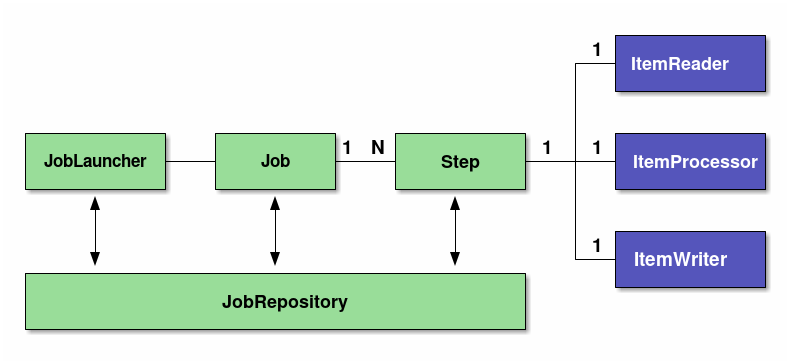

# Spring Batch 아키텍처

## 스프링 배치 모델

- 스프링 배치는 스프링 DI와 AOP를 지원하는 배치 프레임워크이다. 
- 스프링 배치 모델은 다음과 같이 2가지 모델을 가진다. 
  - Tasklet model
    - 단순한 처리 모델을 가지고 있으며, 로직 자체가 단순한경우에 주로 사용한다. 
    - 다양한 데이터소스나 파일을 한번에 처리해야하는 경우 유연함이 있다. 
  - Chunk model 
    - 데이터량이 매우 큰경우 효과적으로 처리가 가능하다. 
    - Reader/Processor/Writer 플로우 방식으로 처리된다. 

## 스프링배치의 기본 아키텍처

- 다음그림과 같은 기본 아키텍처를 가진다. 

- Job
  - Spring Batch에서 일괄 적용을 위한 일련의 프로세스를 요약하는 단일 실행 단위가 된다.
- Step
  - Job을 구성하는 처리단위이다. 
  - 하나의 Job에는 여러 Step이 들어갈 수 있다. 
  - 하나의 Job에 여러 Step을 재사용, 병렬화, 조건분기 등을 수행할 수 있다. 
  - Step은 tasklet 모델 / chunk 모델의 구현체가 탑재되어 실행된다. 
- JobLauncher
  - Job을 수행하기 위한 인터페이스이다. 
  - JobLauncher는 사용자에 의해서 직접 수행된다. 
  - 자바 커맨드를 통해서 CommandLineJobRunner 를 실행하여 단순하게 배치 프로세스가 수행될 수 있다. 
- ItemReader
  - 청크단위 모델에서 사용하며, 소스 데이터를 읽어 들이는 역할을 수행한다. 
- ItemProcessor
  - 읽어들인 청크 데이터를 처리한다. 
  - 데이터 변환을 수행하거나, 데이터를 정제하는 등의 역할을 담당한다. 
  - 옵션으로 필요없다면 사용하지 않아도 된다.
- ItemWriter
  - 청크 데이터를 읽어들였거나, 처리된 데이터를 실제 쓰기작업을 담당한다. 
  - 데이터베이스로 저장하거나, 수정하는 역할을 할 수 있고, 파일로 처리결과를 출력할 수도 있다. 
- Tasklet
  - 단순하고 유연하게 배치 처리를 수행하는 태스크를 수행한다. 
- JobRepository
  - Job과 Step의 상태를 관리하는 시스템이다. 
  - 스프링배치에서 사용하는 테이블 스키마를 기반으로 상태정보를 저장하고 관리한다. 

## 스프링배치 흐름

- 스프링 배치의 기본 흐름을 이해하는 것은 매우 중요하다. 
- 기본 아키텍처에서 설명한 구조가 어떻게 흘러가는지 다음 그림을 통해 확인하자. 

### 처리흐름 관점

1. JobScheduler 가 배치를 트리거링 하면 JobLauncher 를 실행한다. 
2. JobLauncher 는 Job을 실행한다. 이때 JobExecution 을 수행하고, Execution Context 정보를 이용한다.
3. Job은 자신에게 정으된 Step을 실행한다. 이때 StepExecution을 수행하고, Execution Context 정보가 전달되어 수행된다. 
4. Step은 Tasklet과 Chunk모델을 가지고 있으며 위 그림에서는 Chunk 모델로 수행되게 된다. 
5. Chunk 모델은 ItemReader를 통해서 소스 데이터를 읽어 들인다. 
6. ItemProcessor를 통해서 읽어들인 청크단위 데이터를 처리한다. 처리는 데이터를 변환하거나 가공하는 역할을 하게 된다. 
7. ItemWriter는 처리된 청크 데이터를 쓰기작업한다. 다양한 Writer를 통해 데이터베이스에 저장하거나, 파일로 쓰는 역할을 하게 된다. 

### Job 정보의 흐름 관점

1. JobLauncher는 JobRepository를 통해서 JobInstance정보를 데이터베이스에 등록한다. 
2. JobLauncher는 JobRepository를 통해서 Job Execution 을 통해 Job 수행하고 실행 정보를 데이터베이스에 저장한다. 
3. JobStep은 JobRepository를 통해서 I/O 레코드와 상태정보를 저장한다. 
4. 잡이 완료되면 JobRepository를 통해서 데이터베이스에 완료 정보를 저장한다. 

### 스프링배치 저장 정보

- JobInstance
  - JobInstance는 잡 이름과 전달 파라미터를 정의한다. 
  - Job이 중단되는 경우 다음 실행할때 중단 이후부터 실행하도록 지원한다. 
  - Job이 재실행을 지원하지 않는경우, 혹은 성공적으로 처리된 경우 배치를 재실행 한다면 중복 수행되지 않도록 종료한다. 
- JobExecution / ExecutionContext
  - JobExecution
    - JobExecution은 잡의 물리적인 실행을 나타낸다.
    - JobInstance와 달리 동일한 Job이 여러번 수행될 수 있다. 
    - 그러므로 JobInstance 와 JobExecution은 1:N 관계가 된다. 
  - ExecutionContext
    - ExecutionContext는 각각의 JobExecution 에서 처리 단계와 같은 메타 정보들을 공유하는 영역이다. 
    - ExecutionContext는 주로 스프링배치가 프레임워크 상태를 기록하는데 사용하며, 또한 애플리케이션에서 ExecutionContext에 액세스 하는 수단도 제공된다.
    - ExecutionContext에 저장되는 객체는 java.io.Serialized를 구현하는 클래스이어야 한다. 
- StepExecution / ExecutionContext
  - StepExecution
    - StepExecution은 Step을 물리적인 실행을 나타낸다. 
    - Job은 여러 Step을 수행하므로 1:N 관계가 된다. 
  - ExecutionContext
    - Step내부에 데이터를 공유해야하는 공유 영역이다. 
    - 데이터의 지역화 관점에서 여러 단계에 공유 할 필요가 없는 정보는 Job내 ExecutionContext를 이용하는 대신에, Step 단계 내의 ExecutionContext를 사용해야한다.
    - StepExecutionContext에 저장되는 데이터는 반드시 java.io.Serializable 를 구현해야한다. 
- JobRepository
  - JobExecution과 StepExecution등과 같이 배치 실행정보나 상태, 결과정보들이 데이터베이스에 저장될 필요가 있으며 이를 처리하는 것이 JobRepository이다. 
  - 즉 스프링배치를 수행하기 위해서 이를 저장할 데이터베이스가 필요하다. 
  - 이렇게 저장된 정보를 활용하여 스프링배치는 배치 잡을 재실행 하거나, 정지된 상태 후부터 수행할 수 있는 수단을 제공하게 된다. 

## WrapUp

- 지금까지 스프링 배치의 구조에 대해서 알아보았다. 
- 스프링 배치는 tasklet모델, chunk모델 2가지 모델을 제공한다. 
- 처리의 흐름과 데이터의 흐름에 대해서도 살펴 보았다. 

## 참고

- https://terasoluna-batch.github.io/guideline/5.0.0.RELEASE/en/Ch02_SpringBatchArchitecture.html#Ch02_SpringBatchArch_Detail_Performance